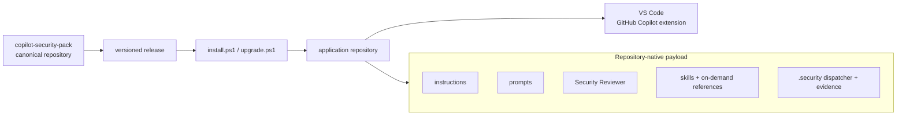
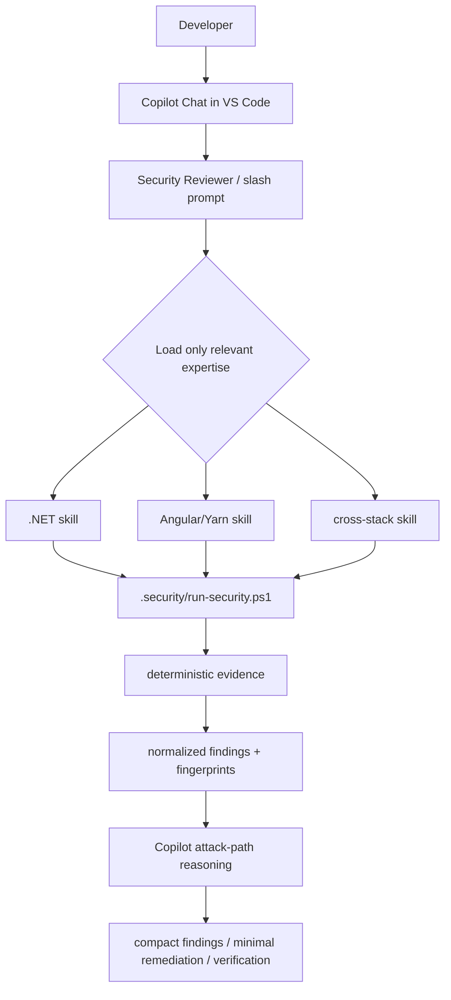
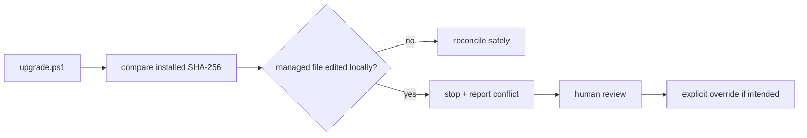

# Copilot Security Pack

Repository-native security pack for **GitHub Copilot Chat in Visual Studio Code**, targeting **.NET API + Angular/Yarn repositories and monorepos**.

## Supported host

This project is intentionally designed for the **GitHub Copilot VS Code extension**.

It does not require Copilot CLI, a Copilot plugin marketplace, MCP servers, or Git submodules. After installation, the application repository is self-contained.

## Architecture



Root `.github/` and `.security/` configure and test this source repository. **`pack/` is the source of truth for files distributed to application repositories.**

See [Architecture Diagrams](docs/ARCHITECTURE_DIAGRAMS.md) for distribution, developer review, dependency baseline, upgrade ownership, cross-stack authorization, and blind-pilot diagrams.

## Security review flow



## What the pack provides

- Small repository-wide and path-specific Copilot security instructions.
- A `Security Reviewer` custom agent.
- On-demand .NET, Angular/Yarn, and cross-stack security skills.
- Progressive-disclosure skill references loaded only for deeper domain review.
- Reusable prompt commands for changed-code review, dependencies, privileged flows, finding investigation/remediation, full audits, and initial baseline adoption.
- `.security/run-security.ps1` as the single automation entry point.
- Direct and transitive NuGet vulnerability evidence.
- Yarn Classic and modern Yarn audit evidence.
- Per-advisory normalized findings with stable SHA-256 fingerprints.
- Existing-vulnerability baseline support without suppressing newly introduced risk.
- CI policy gating that fails new high/critical findings and scanner failures.
- Blind fixture/evaluation tooling for measuring actual VS Code Copilot behavior.

## Developer UX

Inside Copilot Chat in VS Code:

```text
/security-review-changes
/security-review-dependencies
/security-review-flow
/security-investigate-finding
/security-fix-finding
/security-full-audit
/security-initialize-baseline
```

Developers should not need to learn individual scanner commands. Copilot runs the stable dispatcher itself through VS Code's terminal tooling:

```powershell
pwsh -NoProfile -File .security/run-security.ps1 -Mode Changes
```

Detailed scanner evidence remains under `.security/output`; chat responses should stay compact and evidence-based.

## Install

Clone or check out the desired version of this repository, then preview the target change:

```powershell
pwsh -NoProfile -File ./installer/install.ps1 `
  -TargetRepo C:\src\my-application `
  -WhatIf
```

Install:

```powershell
pwsh -NoProfile -File ./installer/install.ps1 `
  -TargetRepo C:\src\my-application
```

The installer detects .NET, Angular/Yarn, and combined repositories, installs only applicable payload files, preserves repository-owned policy/baseline/exception files, and does not blindly overwrite an existing `.github/copilot-instructions.md`.

## Upgrade safety



```powershell
pwsh -NoProfile -File ./installer/upgrade.ps1 `
  -TargetRepo C:\src\my-application
```

Managed files are tracked by SHA-256. If an installed managed file was edited locally, upgrade stops instead of overwriting it. `-ForceManagedOverwrite` exists only for an explicitly reviewed conflict.

Uninstall removes unchanged pack-managed files while preserving locally modified and repository-owned files:

```powershell
pwsh -NoProfile -File ./installer/uninstall.ps1 `
  -TargetRepo C:\src\my-application
```

See [installer/README.md](installer/README.md) and [docs/DISTRIBUTION_AND_RELEASES.md](docs/DISTRIBUTION_AND_RELEASES.md).

## Dependency adoption model

Normal dependency review:

```powershell
pwsh -NoProfile -File .security/run-security.ps1 -Mode Dependencies
```

For a repository adopting the pack for the first time, existing dependency debt can be established once through the `/security-initialize-baseline` prompt. Copilot first shows exactly what would be grandfathered and asks for explicit approval. The underlying confirmed operation is:

```powershell
pwsh -NoProfile -File .security/run-security.ps1 `
  -Mode InitializeBaseline `
  -ConfirmBaseline
```

Safety rules:

- Scanner errors cannot be baselined.
- A non-empty baseline cannot be replaced by the initialization workflow.
- New vulnerabilities discovered after initialization remain `new`.
- New high/critical findings remain blocking.
- Baseline is legacy-debt classification, not proof that a vulnerability is acceptable.

## Cross-stack security model

For privileged flows, review traces:

```text
Angular component
  -> service/interceptor
  -> HTTP request
  -> ASP.NET endpoint
  -> authentication
  -> authorization policy/role
  -> tenant/object ownership
  -> repository/database query
  -> response DTO
```

UI guards are never treated as API authorization.

## Open-source design

The project is released under the [MIT License](LICENSE).

Its architecture is informed by public projects such as GitHub Awesome Copilot, Microsoft vscode-copilot-chat, GitHub Spec Kit, dotnet/skills, and obra/superpowers. They are design references rather than runtime dependencies. We deliberately adopt useful repository-native patterns while rejecting distribution paths that conflict with the VS Code-only host constraint.

See [Open Source and External Design Patterns](docs/OPEN_SOURCE_AND_EXTERNAL_PATTERNS.md).

## Release maturity

- `v0.1.0-alpha.1`: architecture preview.
- `v0.2.0-alpha.1`: versioned installer, canonical payload, dependency normalization, fingerprints, and guarded baseline workflow.
- `v0.3.0-alpha.1`: realistic fixture, blind VS Code Copilot evaluation harness, and Yarn/Corepack portability hardening.
- `v0.4.0-alpha.1`: architecture diagrams, open-source licensing, and progressive-disclosure skill references (development line).
- Stable `v1.0.0`: only after representative real-repository/VDI validation and additional hardening.

A passing scan is evidence from the checks that ran; it is never proof that an application is vulnerability-free.
