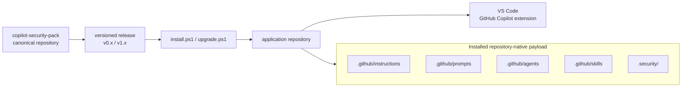
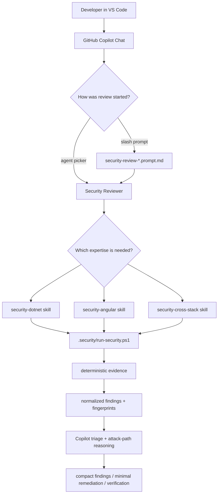
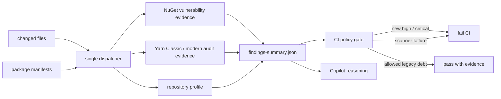
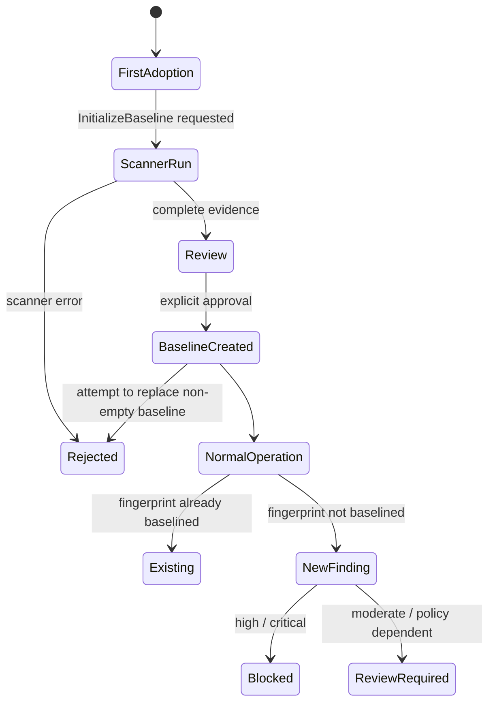
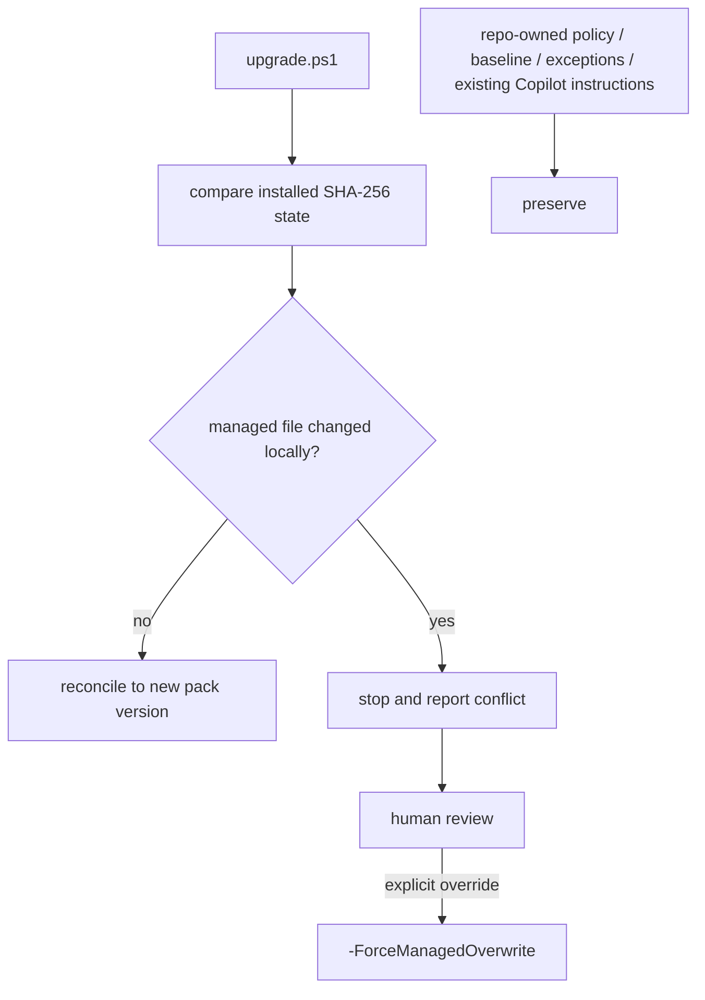

# Architecture Diagrams

These diagrams explain the repository-native Copilot Security Pack without requiring Copilot CLI, MCP, a marketplace, or a submodule.

## 1. Distribution architecture

The target repository is self-contained after installation. The canonical repository is only needed again when installing or upgrading.

## 2. Developer review flow

## 3. Deterministic evidence boundary

Deterministic tools produce evidence. Copilot is responsible for contextual security reasoning, not for inventing scanner results.

## 4. Cross-stack authorization trace

```mermaid
flowchart LR
    component["Angular component / route"] --> service["Angular service"]
    service --> request["HTTP request"]
    request --> endpoint["ASP.NET endpoint"]
    endpoint --> authentication["authentication"]
    authentication --> authorization["authorization policy / role"]
    authorization --> ownership["tenant / object ownership"]
    ownership --> query["repository / DB query"]
    query --> dto["response DTO"]

    guard["UI guard"] -. "navigation UX only" .-> component
    guard -. "never substitutes for" .-> authorization
```

The review follows the real data and authorization path. A browser-side route guard or hidden button is never considered an API security boundary.

## 5. Dependency baseline lifecycle

A baseline classifies pre-existing debt. It is not a suppression mechanism and is not evidence that a vulnerability is acceptable.

## 6. Upgrade ownership model

## 7. Blind VS Code pilot

```mermaid
flowchart LR
    fixture["intentionally vulnerable fixture"] --> prep["prepare-pilot.ps1"]
    prep --> workspace["clean standalone Git repo"]
    workspace --> install["install current pack"]
    install --> vscode["open only pilot repo in VS Code"]
    vscode --> review["run normal Security Reviewer flows"]
    review --> record["record output first"]
    record --> rubric["score against external rubric"]
    rubric --> improve["change smallest responsible layer"]
    improve --> rerun["repeat same blind scenario"]
```

The evaluation answer key remains outside the application workspace so Copilot cannot discover the expected findings during the blind run.
