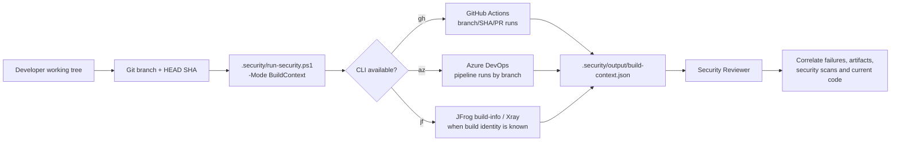

# Build Intelligence

Build Intelligence lets the repository-native Copilot Security Pack correlate the developer's current Git branch/worktree with CI and artifact-security evidence available through locally installed CLIs.

## Supported adapters

- GitHub CLI (`gh`) for GitHub Actions workflow runs and PR checks.
- Azure CLI (`az`) with the Azure DevOps extension for pipeline runs and artifacts.
- JFrog CLI (`jf`) for published build-info and Xray build scanning when a build identity can be resolved.

These are **not Copilot clients**. GitHub Copilot Chat in the VS Code extension remains the only supported Copilot host. The CLIs are read-only evidence providers invoked through VS Code Agent terminal tooling.

## Agentic flow



## Safety model

The default BuildContext mode is observational:

- never queues or re-runs a pipeline;
- never cancels or deletes a run;
- never publishes, promotes, deletes, or mutates JFrog build-info;
- never changes Azure DevOps configuration;
- never performs an interactive login;
- never echoes credentials or complete tokens;
- records unavailable/not-authenticated adapters as evidence instead of failing the whole review.

A future explicit action mode can be added separately if write operations are ever needed.

## Branch and worktree correlation

The dispatcher resolves once:

- repository root;
- current branch (or detached-HEAD state);
- HEAD SHA;
- remote origin URL;
- changed files.

Adapters consume that same immutable context so evidence from different providers refers to the same developer state.

### GitHub

Prefer exact commit evidence when possible and branch evidence second. For PR branches, `gh pr checks` can supplement `gh run list`.

### Azure DevOps

Use `az pipelines runs list --branch <branch>` with auto-detection from Git configuration where the Azure DevOps extension supports it. Keep result count small and request JSON output.

### JFrog

JFrog requires a build name/number before `jf build-scan` can inspect a published build. The adapter resolves these only from explicit repository configuration or CI metadata already present in discovered GitHub/Azure evidence. It does not guess arbitrary build names.

Repository-specific mappings can be added to `.security/build-intelligence.yml` without changing the agent prompt.

## Output contract

`.security/output/build-context.json` is compact and normalized:

```json
{
  "schema": 1,
  "git": {
    "branch": "feature/example",
    "headSha": "abc123...",
    "detached": false
  },
  "providers": {
    "github": { "status": "available", "runs": [] },
    "azure": { "status": "not-configured", "runs": [] },
    "jfrog": { "status": "not-resolved", "builds": [] }
  }
}
```

The agent reads this normalized file instead of ingesting raw CLI logs.
