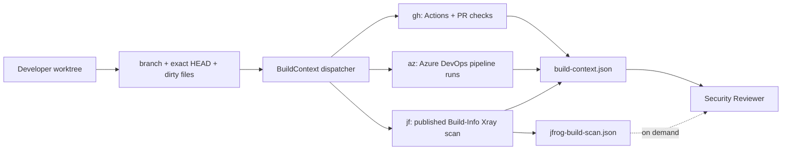

# Build Intelligence

Build Intelligence correlates the developer's current Git branch/worktree with CI and artifact-security evidence available through locally installed CLIs.

GitHub Copilot Chat in the **VS Code extension remains the only supported Copilot host**. `gh`, `az`, and `jf` are read-only evidence providers invoked by the Security Reviewer through VS Code Agent terminal tooling.

## Developer flow

Use:

```text
/security-review-build
```

or run the underlying stable dispatcher:

```powershell
pwsh -NoProfile -File .security/run-security.ps1 -Mode BuildContext
```



## Correlation rules

The collector resolves the repository root, branch, exact HEAD SHA, origin and dirty-worktree files once. Every provider command executes **from that target repository**, even if the VS Code terminal was opened from another directory.

Remote CI can only represent committed code. If the worktree is dirty, `git.remoteBuildScope` is `committed-head-only`; the agent must not claim that the remote build contains uncommitted edits.

### GitHub CLI

The adapter uses read-only commands:

```text
gh auth status
gh run list --commit <HEAD> ...
gh run list --branch <branch> ...   # fallback only
gh pr view <branch> --json ...
gh pr checks <branch> --json ...
```

`gh run list` supports exact `--commit` and `--branch` filters. Exact HEAD is preferred. `gh pr checks` exit code `8` means checks are pending; valid JSON from that state is preserved as evidence instead of being treated as a command failure.

### Azure DevOps CLI

Requires Azure CLI plus the **already installed** `azure-devops` extension. Build Intelligence checks the extension first and does not intentionally install it.

The adapter uses:

```text
az pipelines runs list --branch <branch> --top 10 --query-order QueueTimeDesc ...
```

Azure DevOps authentication is **not** inferred from `az account show`. Microsoft supports Azure DevOps CLI authentication through Azure sign-in, `az devops login`, or the `AZURE_DEVOPS_EXT_PAT` environment variable. The pack never asks for or prints the PAT.

When `pipelineIds` are configured they are passed as separate values, for example:

```text
--pipeline-ids 42 43
```

Returned runs are normalized and compared with HEAD using Azure's `sourceVersion`. A matching SHA is classified `exact-head`; otherwise evidence is branch-level only.

### JFrog CLI

JFrog build identity is repository-specific and is never guessed. `.security/build-intelligence.json` must provide a build name plus a fixed build number or an explicit mapping from discovered GitHub/Azure metadata.

The adapter uses a published-build Xray scan:

```text
jf build-scan <build-name> <build-number> --format=json --vuln
```

`--vuln` requests vulnerability data independently of whether the build is covered by a Watch/Fail Build policy. JFrog exit code `3` is classified as `policy-violation`: the scan completed and produced security evidence, so it is **not** treated as an execution failure.

Full JFrog JSON is written to `.security/output/jfrog-build-scan.json` and only read on demand. The compact build context contains a pointer to that file.

## Repository configuration

`.security/build-intelligence.json` is repository-owned and created only when missing. Do not store credentials in it.

Example:

```json
{
  "schema": 1,
  "azure": {
    "organization": "https://dev.azure.com/example",
    "project": "ExampleProject",
    "pipelineIds": [42, 43]
  },
  "jfrog": {
    "serverId": "example-jfrog",
    "project": "project-key",
    "buildName": "app-build",
    "buildNumberFrom": "azureBuildId"
  }
}
```

Supported JFrog `buildNumberFrom` values:

- `githubRunNumber`
- `githubRunId`
- `azureBuildId`
- `azureBuildNumber`

A fixed `jfrog.buildNumber` is also supported and is labeled `configured` in the evidence.

## Status semantics

Provider state is explicit; absence is never interpreted as a clean scan.

- `unavailable`: CLI executable is not present.
- `not-authenticated`: GitHub CLI is present but not authenticated.
- `extension-unavailable`: Azure CLI is present but Azure DevOps extension is not installed.
- `not-configured`: provider cannot safely resolve repository/project context.
- `no-branch`: detached HEAD prevents branch-only Azure lookup.
- `not-resolved`: JFrog build identity cannot be derived safely.
- `query-failed`: the provider was invoked but evidence retrieval failed.
- `available`: provider evidence was retrieved.

## Output contract

`.security/output/build-context.json` schema 2 is compact and normalized:

```json
{
  "schema": 2,
  "git": {
    "branch": "feature/example",
    "headSha": "abc123...",
    "worktreeDirty": true,
    "remoteBuildScope": "committed-head-only"
  },
  "providers": {
    "github": { "status": "available", "correlation": "exact-head", "runs": [] },
    "azure": { "status": "available", "correlation": "branch", "runs": [] },
    "jfrog": { "status": "available", "builds": [] }
  }
}
```

Raw CLI logs are not copied into chat. Provider errors record only operation/exit-code/parse-state metadata. Credentials and complete tokens must never be echoed.

## Safety model

BuildContext is observational. It never intentionally:

- queues, reruns or cancels CI;
- uploads/downloads build artifacts automatically;
- publishes, promotes or deletes JFrog Build-Info;
- changes Azure DevOps defaults;
- installs provider CLIs/extensions;
- performs interactive authentication;
- prints credentials or tokens.

Write operations, if ever added, require a separate explicit capability and approval model.
