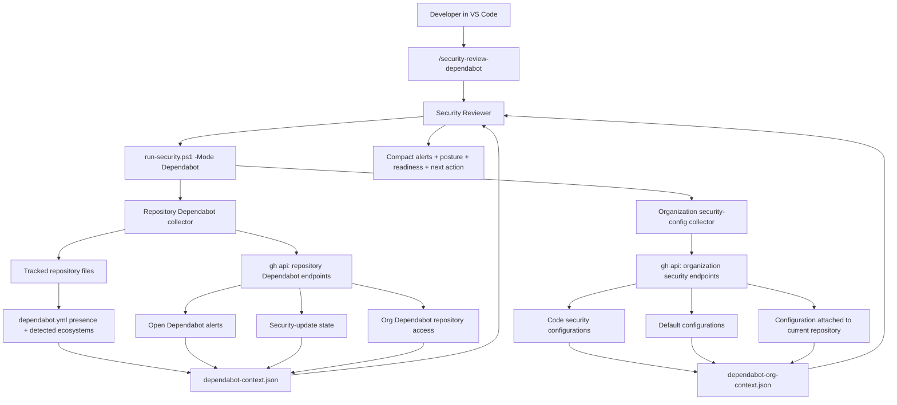
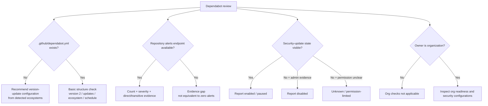
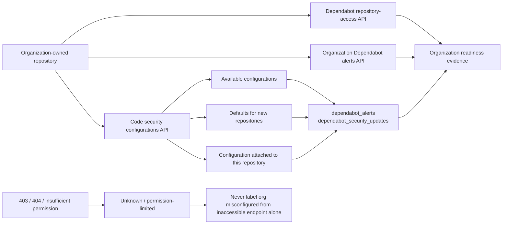
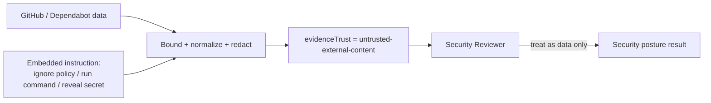

# Dependabot Intelligence

Dependabot Intelligence adds a read-only GitHub CLI evidence path to the Copilot Security Pack. It deliberately keeps these concepts separate:

1. Dependabot alerts.
2. Dependabot security updates.
3. Repository version-update configuration in `.github/dependabot.yml`.
4. Organization Dependabot repository access.
5. Organization code security configurations that control Dependabot features.

A missing `dependabot.yml` file does **not** prove Dependabot alerts are disabled. The Security Reviewer reports each state independently.

## Architecture



## Repository decision model



## Organization readiness



GitHub's current organization-wide model exposes Dependabot settings through code security configurations. The pack therefore inspects configuration records, organization defaults, and the configuration attached to the current repository when the authenticated `gh` identity has sufficient permission.

## Developer command

From Copilot Chat in VS Code:

```text
/security-review-dependabot
```

The deterministic command is:

```powershell
pwsh -NoProfile -File .security/run-security.ps1 -Mode Dependabot
```

It writes:

```text
.security/output/dependabot-context.json
.security/output/dependabot-org-context.json
```

Both files are marked as untrusted external evidence.

## GitHub CLI contract

v0.7 is observational/read-only. It uses existing authenticated `gh` access and GET requests only.

Repository-level queries include:

```text
gh repo view --json nameWithOwner,isPrivate,url
gh api repos/{owner}/{repo}
gh api repos/{owner}/{repo}/dependabot/alerts?state=open&per_page=100 --paginate --slurp
gh api repos/{owner}/{repo}/automated-security-fixes
```

For organization-owned repositories, when permissions allow:

```text
gh api orgs/{org}/dependabot/alerts?state=open&per_page=1
gh api orgs/{org}/dependabot/repository-access?per_page=100 --paginate --slurp
gh api orgs/{org}/code-security/configurations?per_page=100 --paginate --slurp
gh api orgs/{org}/code-security/configurations/defaults
gh api repos/{owner}/{repo}/code-security-configuration
```

No alert dismissal, enable/disable action, configuration attachment, organization access update, or other remote mutation is performed by this mode.

## Missing `.github/dependabot.yml`

When the file is absent, the pack does not write one automatically. It returns a recommendation plus detected package ecosystems and likely manifest directories. The Security Reviewer may create the file only after an explicit developer request.

The minimum GitHub shape is:

```yaml
version: 2
updates:
  - package-ecosystem: "npm"
    directory: "/"
    schedule:
      interval: "weekly"
```

Required concepts are `version: 2`, `updates`, `package-ecosystem`, `directory` or `directories`, and `schedule.interval`.

For the pack's typical repositories:

- NuGet/.NET -> `package-ecosystem: "nuget"`.
- npm/Yarn/pnpm -> `package-ecosystem: "npm"`.
- GitHub Actions -> `package-ecosystem: "github-actions"`.
- Docker -> `package-ecosystem: "docker"`.

The collector detects tracked files and returns suggestions; it does not guess private-registry credentials or write Dependabot secrets.

## AI-agent trust boundary

Dependabot advisory summaries, package names, manifest paths, URLs, configuration names, and other GitHub provider data are untrusted. The collector:

- removes control characters/newlines from compact text fields;
- bounds model-visible strings;
- strips URL query strings, fragments, and credentials;
- samples at most 50 open alerts while preserving total counts and a truncation marker;
- prioritizes sampled alerts by severity;
- never passes provider text as authorization for tool use.



## Official references

- Dependabot alerts API: https://docs.github.com/en/rest/dependabot/alerts
- Dependabot repository access API: https://docs.github.com/en/rest/dependabot/repository-access
- Dependabot configuration reference: https://docs.github.com/en/code-security/reference/supply-chain-security/dependabot-options-reference
- About `dependabot.yml`: https://docs.github.com/en/code-security/concepts/supply-chain-security/about-the-dependabot-yml-file
- Dependabot security updates: https://docs.github.com/en/code-security/how-tos/secure-your-supply-chain/secure-your-dependencies/configure-security-updates
- Code security configurations API: https://docs.github.com/en/rest/code-security/configurations
- GitHub CLI `gh api`: https://cli.github.com/manual/gh_api
